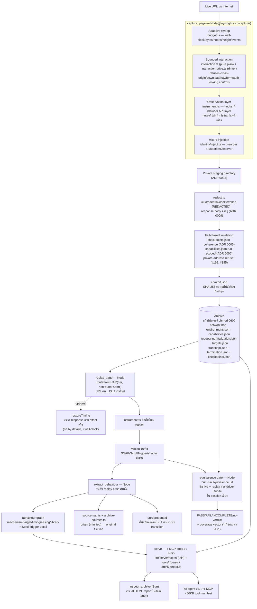

# รายงานการวิเคราะห์สถาปัตยกรรมและแนวคิดของ Clone Space (clone-space-mcp)

*(Architecture Analysis and Technical Breakdown of clone-space-mcp)*

> Snapshot จาก repo `D:\Github\Clone Space` — branch `main`, commit `205a616c` (2026-08-17), อ่านเมื่อ 2026-09-02
> ทุกตัวเลขในเอกสารนี้มาจากไฟล์ที่ระบุ path ไว้ข้าง ๆ ไม่ใช่การรันวัดใหม่

---

## 1. บทสรุปผู้บริหาร (Executive Summary)

**Clone Space (`clone-space-mcp`)** เป็น MCP server ที่ **archive หน้าเว็บจริงบน internet ให้ replay แบบออฟไลน์โดยที่ motion ยังทำงานอยู่** — carousel ยังเลื่อนได้, GSAP timeline ยังรันอยู่, ScrollTrigger ยัง fire — แล้วบอกด้วยว่า **บรรทัดโค้ดไหน** เป็นตัวสั่งการเคลื่อนไหวนั้น (`README.md:1-9`)

การ "save page" ธรรมดาจากเบราว์เซอร์ได้แค่โครงกระดูก (markup รอด แต่พฤติกรรมตาย) จุดยืนของ Clone Space คือปฏิเสธแนวทางนั้นตั้งแต่ต้น: **การ serialize DOM ที่ hydrate แล้วให้เป็นไฟล์ standalone คือแนวทางที่โปรเจกต์นี้ปฏิเสธ** เพราะมันทำลาย hydration และ entry animation ซึ่งเป็นสิ่งที่โปรเจกต์ไล่ตามอยู่พอดี (`README.md:11-14`, `CLAUDE.md:30-34`)

**การตัดสินใจที่แบกน้ำหนักที่สุด (load-bearing decision):** replay เปิด **URL เดิม** ด้วย document HTML เดิม เสิร์ฟจาก HAR ผ่าน `routeFromHAR(har, { notFound: 'abort' })` เพื่อให้ **JavaScript จริงของหน้านั้นรันใหม่อีกครั้ง** ไม่ใช่การ mock หรือ replay แบบ synthetic

ผลลัพธ์คือเครื่องมือที่ agent ใช้ **อ่าน mechanism ของ frontend จริง** ได้ตรง ๆ — ไม่ใช่แค่เดาจาก markup หรือ screenshot: shader ที่ประกอบขึ้นจาก string ตอน runtime, timing/easing ของ animation library, และตำแหน่ง `file:line` จริงในซอร์สที่ไม่ได้ minify ผ่าน sourcemap resolution

สถานะปัจจุบันคือ **Alpha และเปิดเผยว่าเป็น alpha ตรง ๆ** (`README.md:322`) — ทั้งสี่ stage (capture → replay → extract → serve) รันจบ end-to-end แล้ว แต่มีข้อจำกัดที่รู้อยู่และถูกบันทึกไว้อย่างละเอียด ไม่ใช่ซ่อนไว้

---

## 2. จุดกำเนิดและปรัชญาการออกแบบ (Origin & Core Philosophy)

### 2.1 North-star ที่นิยามความสำเร็จแบบวัดได้

`CLAUDE.md:18-28` เขียนไว้ตรง ๆ ว่า "การวัดว่าเสร็จ" ไม่ใช่ "เซฟ HTML ได้แล้ว" แต่คือ: ตัดเน็ต → `capture` หน้าที่มี GSAP หนัก ๆ → `replay` แล้วดู motion รันจริง → `extract` behavior graph → `serve` ให้ agent ตอบคำถาม *"อะไรทำให้ hero เคลื่อนไหว"* ได้ถูกต้อง พร้อมอ้างไฟล์และบรรทัด

### 2.2 ปัญหาที่โปรเจกต์แก้

1. **Dead skeleton problem** — เครื่องมือ archive ทั่วไป (wget, save-as, DOM snapshot) เก็บ markup ได้แต่ behaviour ตาย เพราะไม่มี JavaScript context ที่ถูกต้องให้รันต่อ
2. **Runtime-only artifacts** — GSAP timeline, WebGL shader ที่ assemble จาก string+uniform ตอน runtime ไม่มีอยู่ใน **ไฟล์ที่ archive ได้เลย** ต้อง **รันหน้าเว็บจริง** ถึงจะเห็น (`README.md:98-104`)
3. **Minified position ไร้ความหมาย** — runtime บอกตำแหน่งเป็น `three.module.min.js:12:326662` ซึ่งคือบรรทัด 12 ของไฟล์ที่มีสิบกว่าบรรทัด อ่านไม่รู้เรื่อง ต้องผ่าน sourcemap ถึงจะกลับเป็น `file:line` ที่มีความหมาย
4. **"ดูเหมือนถูก" ไม่ใช่ "วัดว่าเท่ากัน"** — clone ที่หน้าตาเหมือนกันอาจพฤติกรรมต่างจากต้นฉบับโดยไม่มีใครรู้ ถ้าไม่มีกลไกเทียบ live กับ replay จริง ๆ

### 2.3 หลักออกแบบซ้ำที่เห็นได้ในทุก ADR

- **"Reported, never guessed"** — ทุกจุดที่ไม่แน่ใจ ระบบ**รายงานว่าไม่แน่ใจ**แทนที่จะเดา: `identity-unresolved` (ADR 0002), `"undetermined"` tri-state (ADR 0006), `unrepresented` ใน behaviour graph, `unservable` ตอน replay
- **Fail-closed publication** — archive จะไม่ถูก publish ถ้า validation ไม่ผ่าน ไม่มี "soft success" (ADR 0005, 0006)
- **Measure, don't reason** — ทุก decision ใหญ่มีการวัดจริงกำกับ ไม่ใช้ argument ลอย ๆ (ตัวอย่างเยอะมากใน §4)
- **Refuse rather than mix classes** — เช่น run-scoped artifact (`network.har`, `capabilities.json`) ต้อง**ไม่ผูก** checkpoint binding เพราะการผูกแบบผิด "อ่านเป็นการรับประกัน" ที่ผิดจากความจริง (ADR 0006)

---

## 3. สถาปัตยกรรมและ pipeline (System Architecture)

### 3.1 ทำไม runtime แยกเป็น Node กับ Bun (ADR 0001)

ตอนสร้าง spike harness สำหรับ #3 พบว่า **Playwright client ไม่ทำงานภายใต้ Bun** วัดจริงบนเครื่องเดียวกัน (`docs/adr/0001-node-drives-the-browser-bun-runs-everything-else.md:16-22`):

| Layer | Bun 1.3.14 | Node 22.23.1 |
|---|---|---|
| Raw CDP over websocket (ไม่ผ่าน Playwright client) | OK, 99 ms | ไม่ได้รัน |
| `chromium.connectOverCDP` (Playwright client) | timeout 20 s | ไม่ได้รัน |
| `chromium.launch` (`--remote-debugging-pipe`) | timeout 30 s | OK, 68 ms |

Bun spawn Chromium ได้และพูด CDP ได้ใน 99 ms แปลว่าปัญหาไม่ได้อยู่ที่ browser หรือ networking ของ Bun แต่อยู่ **ข้างใน Playwright client เองภายใต้ Bun** ทางเลือกที่ถูกปฏิเสธคือ reimplement `routeFromHAR` เองบน Bun (ความเสี่ยงสูงเกินไป เพราะมันคือกลไกที่ replay ทั้งหมดพึ่งพา) ผลคือ **Node ขับ browser ทุกอย่าง, Bun รันทุกอย่างที่เหลือ** (lint, typecheck, test, build, fixture server)

### 3.2 Capture — สิ่งที่เก็บได้จริง ไม่ใช่แค่ตามที่ README เคลม

ตรวจไฟล์จริงใน `src/capture/` (2026-09-02): `budget.ts`, `checkpoints.json`, `commit.ts`, `environment.ts`, `instrument.ts`, `interaction-drive.ts`, `interaction.ts`, `network-drain.ts`, `private-address.ts`, `record.ts`, `redact.ts`, `request-normalization.ts`, `target-ref.ts`, `targets.ts`, `transcript.ts` — ครบตามที่ README และ ADR อธิบาย

**จุดสำคัญที่สุดของ instrumentation:** hook ถูกติดตั้งที่ **browser API layer** (เช่น `WebGLRenderingContext.prototype.shaderSource`) ไม่ใช่ที่ library เฉพาะเจ้า เพราะทุกอย่างต้องผ่าน WebGL ในที่สุดไม่ว่าจะเขียนด้วย library ไหน วัดได้จริงบน `www.chaingpt.org` ที่ `THREE` ไม่ได้เป็น global variable (โหลดเป็น ES module) แต่ shader ทุกตัวยังถูกจับได้ (`README.md:92-99`)

### 3.3 ตารางความสามารถในการ capture ต่อ mechanism

| Mechanism | เก็บได้อย่างไร | หลักฐาน/ตัวเลข | Source |
|---|---|---|---|
| DOM structure + element identity | injected script assign `wa:<frame-key>:<sequence>` แบบ preorder + `MutationObserver`; fingerprint reconciler จับคู่ข้ามรอบ | fixture: 63/63 matched, 0 unresolved, ครบ 5 hard case | `docs/adr/0002-...md:136-141` |
| CSS (stylesheet) | `CSS.getStyleSheetText` ผ่าน CDP ทะลุ CORS ได้ | cross-origin sheet 593 bytes ที่ `document.styleSheets[n].cssRules` อ่านไม่ได้ (`SecurityError`) | `docs/reports/2026-07-30-cdp-spike.md:80-98` |
| DOM snapshot ทั้งต้นไม้ | `DOMSnapshot.captureSnapshot` แบบ columnar/string-interned | 1.381 MB ที่ 6,160 node (237 B/node marginal) → ไม่ต้องมี property allowlist | `docs/reports/2026-07-30-cdp-spike.md:56-71` |
| Event listener (รวม shadow DOM + same-origin iframe) | `getEventListeners({ depth: -1, pierce: true })` หนึ่ง call | 2→4 click listener (open shadow root + same-origin iframe) | `docs/reports/2026-07-30-cdp-spike.md:19-52` |
| WebGL shader (GLSL) | hook ที่ browser API layer ก่อนสคริปต์หน้ารัน | 82,613 ตัวอักษร GLSL, 9 canvas context บน `www.chaingpt.org` | `README.md:98`, `docs/agents/using-the-tools.md` |
| Listener registration count | เช่นเดียวกับข้างบน | 1,510 ครั้ง `addEventListener` บน `www.chaingpt.org` | `README.md:99` |
| Animation (GSAP/CSS via `document.getAnimations()`) | รันจริงบน replay แล้วอ่าน registry | ตรงกันเป๊ะกับ `document.getAnimations()` 12/12 บน firecrawl.dev, 12/12 บน chaingpt.org | `docs/agents/using-the-tools.md:83-95` |
| CSS **transition** | **ไม่อยู่ใน behaviour graph** — เข้า `getAnimations()` เฉพาะตอนกำลังวิ่งเท่านั้น | 318 element มี transition บน firecrawl.dev, 1,028 บน chaingpt.org ที่กราฟไม่รายงาน | `docs/agents/using-the-tools.md:83-95` |
| Network (request/response) | Playwright `recordHar({ mode:'full', content:'attach' })` | ทุก request/response แนบเป็นไฟล์แยก | `README.md:261` |
| Target inventory (OOPIF, popup, worker, worklet) | `Target.setDiscoverTargets` (เปิดหลัง `page.goto`) + `Target.getTargets` snapshot ที่ observation boundary | เปิดหลัง navigate — target ที่เกิดและตายระหว่าง navigate เอง จะหลุด (known gap) | `docs/adr/0008-...md` |
| Sourcemap → original line | `sourcemap.ts`/`archive-sources.ts` ตาม `sourceMappingURL` ไปยัง response ที่ capture ดึงไว้แล้ว ไม่ fetch เพิ่ม | `three.module.min.js:12:326662` → `three.module.js:18723:5` (บรรทัดจริง `gl.shaderSource(...)`) | `README.md:150-157` |

### 3.4 Replay — ทำไม `restoreTiming` ถึง off by default

`replay/replay.ts` + `replay/arrival-schedule.ts` เสิร์ฟ archive และ **abort** ทุก request ที่ archive ไม่มีคำตอบให้ (ไม่ใช่แอบไปเน็ตจริง) `restoreTiming` เป็น option ที่หน่วง response ให้ตรงกับ **offset จากจุดเริ่ม page load** (ไม่ใช่ duration ของตัวมันเอง — ความแตกต่างนี้คือสิ่งที่ทำให้ candidate แรกล้มเหลว) วัดได้จริงบนเว็บ 146-entry: `goto` 825 ms → 4,577 ms และเสร็จ (`README.md:129-134`) เพราะมีต้นทุน wall-clock สูง จึง **off by default**

### 3.5 Element identity — `wa:` id เป็น handle ไม่ใช่ key

จุดที่ ADR 0002 ย้ำหนักที่สุดคือ **`wa:` id มีความหมายแค่ภายในรอบเดียว** เพราะ replay รัน JavaScript ของหน้าใหม่ ตัวนับ sequence จะลงเอยคนละที่ การจับคู่ข้ามรอบต้องใช้ **fingerprint** (tag + stable attribute subset + sibling ordinal + text hash + โหนดแม่) และ fingerprint key ถูก**แยกเป็นสองชั้นโดยตั้งใจ** — เฉพาะสิ่งที่รอดจากการแก้ไขที่จุดอื่นของหน้า (frame key, tag, stable attribute) ถึงจะเป็น bucket key ส่วน sibling ordinal/text hash ใช้แค่**จัดอันดับ**ผู้ท้าชิงที่ share key เดียวกันแล้ว ไม่ใช่ gate การค้นหา

บทเรียนจาก #20 (bug จริง): เวอร์ชันแรกเอา ordinal เข้าไปอยู่ใน key ด้วย ผลคือ element ที่มี unique attribute ถูกรายงาน `missing` ทั้ง ๆ ที่ element ที่ควรจับคู่ปรากฏอยู่ใน `replayOnly` พร้อมกัน — ผลลัพธ์ที่ขัดแย้งในตัวเอง แก้โดยแยก key ออกจาก ranking (`docs/adr/0002-...md:61-76`)

### 3.6 Equivalence gate — วัด ไม่ใช่แค่ดูตาด้วยสายตา

`bun run equivalence <url>` ขับ **live page กับ replayed archive ด้วย driver เดียวกันในเซสชันเดียว** เก็บ digest ชุดเดียวกันจากทั้งสองฝั่งแล้วรายงาน 4 exit code: `0` PASS · `1` FAIL (residual ที่อธิบายไม่ได้) · `2` INCOMPLETE (ยังไม่ได้พิสูจน์อะไรเท่ากันเลย) · `3` รันไม่จบ (`README.md:208-210`)

หลักการที่ตั้งใจฝังไว้ 4 ข้อ:
- **Coverage เป็น vector ไม่ใช่คะแนนเดียว** — ตัวเลขเดียวจะกลบมิติที่อ่อนที่สุดไป
- **`unobserved` ไม่นับเป็น `equal`** — field ที่วัดได้แค่ฝั่งเดียวไม่ถูกเทียบ
- **Live page ถูกขับมากกว่าหนึ่งครั้งเป็น control** — field ที่แกว่งกับตัวเองถูกรายงาน `unstable` แทนที่จะโทษ clone และ `baselinePasses` เผยจำนวนหลักฐานที่ control มีจริง
- **`--measure-perturbation`** ถามว่าการติด instrument เปลี่ยนพฤติกรรมหน้าเว็บหรือไม่ — เทียบกับ**ทุก** pass ธรรมดา ไม่ใช่ pass เดียว (บทเรียนจาก false-positive จริงที่เกิดขึ้น §4.4)

---

## 4. งานวิจัยเชิงประจักษ์และการทดสอบระบบ (Empirical Research & Testing)

### 4.1 Mutation corpus — กลไกที่พิสูจน์ตัวเองว่ามี "เขี้ยว"

`bun run mutate` re-apply defect ที่เคยเกิดขึ้นจริง แล้วบังคับให้ suite แดงผ่าน **test ที่ระบุชื่อไว้** เท่านั้น (`README.md:275`) ปัจจุบันมี **153 entries** (README, อ่าน 2026-09-02) เติบโตมาจาก 7 entry แรกสุด (#53, 2026-08-03)

บทเรียนสำคัญที่สุดจากกลไกนี้ (`CLAUDE.md:180-190`): **จำนวน test ที่มากขึ้นไม่ได้เพิ่มความปลอดภัยเสมอไป** — bug #20 มีชีวิตอยู่ทั้งที่ test 12 ตัวผ่านหมด เพราะทุกตัวถูกเขียนจาก design เดียวกันที่มี flaw นั้นฝังอยู่ ถูกพบโดย agent ที่รัน experiment ที่ไม่มีใครเคยคิดจะรัน

การแยกสถานะผลลัพธ์ก็สำคัญ: **`SURVIVED` คือ finding จริง แต่ `MUTATION NOT APPLIED` ไม่ใช่ `SURVIVED`** — อย่างหลังแปลว่า corpus ไม่ตรงกับโค้ดแล้ว ไม่ได้วัดอะไรเลย (`README.md:283-285`)

### 4.2 Metamorphic check — metric ที่ถูก retract แล้ว re-measure สองรอบ

`bun run metamorphic` วัดว่าโหนดที่ไม่เกี่ยวข้องถูกใส่เข้าไปในหน้าเว็บแล้วทำให้ match count ตกกี่กรณีจาก 400 (seed คงที่ `0x24080426`) ประวัติของตัวเลขนี้เป็นบทเรียนเรื่อง "อย่าเชื่อตัวเลขจนกว่าจะวัดกลไกของการวัดเอง":

| รอบ | ตัวเลข | สถานะ | Source |
|---|---|---|---|
| แรกสุด (#24) | 32/400 vs 135/400 | **RETRACTED** — transform วัด "duplicate element" ไม่ใช่ "unrelated node" | `docs/reports/2026-08-04-metamorphic-baseline.md:20-28` |
| แก้ transform รอบแรก | 78/400 | **RETRACTED** — ยังไม่ตรงกับที่ report บันทึกไว้ (32/400) | `docs/reports/2026-08-04-metamorphic-baseline.md:19` |
| แก้แล้วถูกต้อง | **2/400** (baseline) vs **179/400** (คืน bug #20) | ยืนยันแล้ว — วัดที่ seed เดียวกัน | `docs/reports/2026-08-04-metamorphic-baseline.md:44-62` |

ข้อควรระวังที่ระบุไว้ตรง ๆ ในรายงานเอง: **`179/2 = 89.5` ไม่ใช่ตัวเลขที่ควรอ้าง** เพราะฐานหาร 2 เล็กเกินไป หนึ่งกรณีขยับ ratio ได้เป็นสิบเท่า — ให้อ่านเป็น "สองจำนวนที่ต่างกันสองอันดับ" ไม่ใช่ ratio (`docs/reports/2026-08-04-metamorphic-baseline.md:59-62`) เอกสารเองประกาศชัดว่านี่คือ **metric ไม่ใช่ assertion** — code ที่ถูกต้องเสีย match ได้จริงในบางกรณี รายงานเป็น pass/fail จะสร้างความมั่นใจปลอมทั้งสองทิศทาง

### 4.3 CDP spike — คำถามที่ต้องตอบก่อนออกแบบ interface (2026-07-30)

`docs/reports/2026-07-30-cdp-spike.md` ตอบ 3 คำถามที่ **blocking** ต่อการออกแบบ v1 ก่อนเขียนโค้ดจริง (วัดกับ `test/fixtures/motion-site` ที่มี ground truth ประกาศไว้ใน `fixture-manifest.json`):

- Q1: `getEventListeners({depth:-1, pierce:true})` ทะลุ shadow root + iframe ได้ไหม → **YES** (2→4 click listener)
- Q2: `DOMSnapshot.captureSnapshot` ที่ ~3,000 node กี่ MB → **~0.7 MB** (237 B/node marginal) → ไม่ต้องทำ property allowlist ใน v1
- Q3: `CSS.getStyleSheetText` ทะลุ CORS ได้ไหม → **YES** (593 bytes ที่ในหน้าอ่านไม่ได้เพราะ `SecurityError`)

ที่น่าสนใจคือ **การวัด Q3 รอบแรกให้คำตอบผิด** (`NO`) เพราะ harness เองมี bug — reload หน้าทำให้ `styleSheetId` เก่าใช้ไม่ได้ ถูกบันทึกไว้เป็นบทเรียนว่า "bug ในเครื่องมือวัดสร้าง false negative ที่น่าเชื่อถือได้พอ ๆ กับ finding จริง"

### 4.4 Equivalence gate วันแรกที่มีคำสั่งจริง — 2026-08-17

`docs/reports/2026-08-17-equivalence-verdicts.md` บันทึกการรัน `node scripts/equivalence.ts <url>` จริงบน 3 เว็บตามเกณฑ์ acceptance criterion 7 ของ #171:

| URL | Verdict | Coverage ที่น่าสนใจ |
|---|---|---|
| `www.firecrawl.dev` | FAIL (exit 1) | `motion_settled 0%`, `interaction 63%` — verdict แคบเพราะ coverage ต่ำ |
| `www.chaingpt.org` | INCOMPLETE (exit 2) | `stable_fields 90%` — สองฟิลด์วัดซ้ำแบบเดิมไม่ได้ |
| `labs.chaingpt.org` | **PASS แล้ว FAIL ห่างกันไม่กี่นาที** บนเครื่องเดียวกัน ไม่มีอะไรเปลี่ยน | residual คือ `layout.scrollHeight` — reproduce บั๊ก #182 ได้ในชั่วโมงแรกที่คำสั่งมีอยู่ |

จุดที่รายงานเน้นย้ำ: `unstable (0)` ในรอบที่ FAIL ไม่ได้แปลว่า field นั้นเสถียรจริง — control มีแค่ live 3 + replay 3 pass และบังเอิญ replay ทั้งสามรอบลงที่ค่าเดียวกัน (จากสองค่าที่เป็นไปได้) ทำให้ความต่างถูกโยนไปเป็นความผิดของ clone ทั้งที่ clone ไม่ได้เป็นคนตัดสิน — นี่คือ open half ของ #187

**Network attempt set ก็เป็นตัวอย่างของการถอยตัวเองอย่างมีวินัย:** field `network.origins` เจอความต่างจริง (live 27 vs replay 28 origins) แต่หลังสืบสวนพบว่า `performance.getEntriesByType("resource")` **อิ่มตัวที่ buffer 250 entry ค่าเริ่มต้น** ขณะที่เว็บจริงยิง 248 request — ผลคือ field นี้ถูก**ลดสถานะเหลือแค่รายงาน ไม่เอาไปเทียบ** ภายในหนึ่งชั่วโมงหลัง merge (`docs/reports/2026-08-17-equivalence-verdicts.md:157-181`)

### 4.5 ความน่าเชื่อถือทางสถิติ — บทเรียนเรื่อง p-value ที่ผิด 15 เท่า

การทดสอบ `restoreTiming` ต่อ live site มีรายงานว่า "20 clean draws จาก rate 25% = 0.75^20 = 0.3%" ซึ่งภายหลังถูกพบว่า**ผิด** — เป็นการเทียบตัวอย่างเดียว (one-sample) กับ rate ที่ประมาณมาจาก control เอง ที่ถูกต้องคือ two-sample test: Fisher's exact บน 5/20 เทียบ 0/20 ให้ **p = 0.024 one-tailed, 0.047 two-tailed** — อ่อนกว่าตัวเลขที่ตีพิมพ์ไว้ราว **15 เท่า** (`DONE.md`, entry 2026-08-16 "A published probability was wrong by fifteen times") พบโดย delegated review รอบที่สองในเซสชันเดียวกัน ไม่มี test อัตโนมัติใดจับ statistic ผิดแบบนี้ได้ — lint, typecheck, 558 unit test, 95 browser test และ mutation corpus ผ่านหมดโดยไม่แตะ arithmetic เลย

---

## 5. สถานะปัจจุบันและพัฒนาการล่าสุด (Current Progress & Milestones)

| วันที่ | เหตุการณ์สำคัญ | Source |
|---|---|---|
| 2026-07-30 | CDP spike Q1–Q3 ตอบครบ; พบ Playwright ใช้ไม่ได้ใต้ Bun → ตัดสินใจแยก runtime (ADR 0001) | `docs/reports/2026-07-30-cdp-spike.md` |
| 2026-07-31 | Element identity (`wa:` id + fingerprint reconciler) merge — fixture 63/63 matched, 0 unresolved (ADR 0002) | `docs/adr/0002-...md` |
| 2026-08-01 | Credential redaction ก่อน publish (ADR 0003); แยก environment evidence จาก replay config (ADR 0004) | `docs/adr/0003-...md`, `0004-...md` |
| 2026-08-03 | Checkpoint coherence (ADR 0005, #47); mutation corpus + regression corpus เริ่มต้น 7 entries (#53) | `docs/adr/0005-...md`, `DONE.md` |
| 2026-08-04 | Capability flags (ADR 0006, §6.4, tri-state); metamorphic check เริ่มวัด — retract ตัวเลขแรกทันที | `docs/adr/0006-...md`, `docs/reports/2026-08-04-metamorphic-baseline.md` |
| 2026-08-05 | Gate ที่เคยถูกข้าม (`/code-review`, `/scrutinize`) รันย้อนหลัง เจอ defect จริง 5 จุดในโค้ดที่ merge แล้วและผ่านทุก gate อัตโนมัติ | `DONE.md` |
| 2026-08-09 | Request normalization (ADR 0007, §6.5) ship end-to-end ผ่าน AFK batch | `docs/adr/0007-...md` |
| 2026-08-14 | Target discovery ordering (ADR 0008); response bodies ประกาศว่า **ไม่สามารถ redact ได้** (ADR 0009) จาก `/security-review` finding | `docs/adr/0008-...md`, `0009-...md` |
| 2026-08-16 | Private-address refusal (#162); WebSocket gap พบและ scope ไว้ (#185); equivalence gate reproducibility เริ่มสืบ #182/#187; `t4-verify` self-attested check ถูก arm | `DONE.md` |
| 2026-08-17 | Equivalence gate กลายเป็นคำสั่งจริง (`bun run equivalence`, #171 criterion 5); บันทึก verdict จริง 3 เว็บ | `docs/reports/2026-08-17-equivalence-verdicts.md` |

---

## 6. ข้อจำกัดที่รู้อยู่และถูกบันทึกไว้ตรง ๆ (Known Limitations)

โปรเจกต์นี้มีลักษณะเด่นคือ **ประกาศข้อจำกัดของตัวเองอย่างละเอียด แทนที่จะซ่อนไว้ใน footnote** ข้อจำกัดหลักที่ยังเปิดอยู่ ณ commit ที่อ่าน:

- **`listener_execution` เป็น 0% ในทุก verdict ที่เคยบันทึกไว้** — ยังไม่มี slice ไหนขับ event listener ระหว่าง equivalence run เลย verdict เขียวทุกอันจึงเป็นคำกล่าวเกี่ยวกับ navigation/scroll เท่านั้น ไม่ใช่เกี่ยวกับ interaction (`README.md:328-329`)
- **`layout.scrollHeight` race (#187)** — replay สองรอบของ archive เดียวกันอาจได้ความสูงต่างกัน (root cause: หน้าเว็บวัด element แล้วแช่ผลไว้โดยไม่จัดลำดับกับ resource ที่ขนาดขึ้นกับ) พบวิธีแก้ (`restoreTiming`) แต่ off by default เพราะต้นทุน wall-clock (`README.md:330-333`)
- **CSS transition ไม่อยู่ใน behaviour graph** — เห็นเฉพาะตอนกำลังวิ่งจริงผ่าน `getAnimations()` เท่านั้น หน้าที่ animate ด้วย Tailwind/Framer transition ล้วน ๆ จะรายงาน node น้อยผิดปกติ (`docs/agents/using-the-tools.md`)
- **Out-of-process iframe และ closed shadow root** อยู่นอกเหนือ element identity scheme ปัจจุบัน (ADR 0002 negative/limits)
- **CI required checks ยังไม่ทำงานจริง** — GitHub Actions ถูกล็อกเรื่อง billing (#2) มีแค่ self-attested check (`t4-verify`) ที่ arm ตั้งแต่ 2026-08-16 แทน ไม่ใช่ CI จริง
- **License ยังไม่เลือก** (`README.md:337`)

---

## 7. บทเรียนและข้อคิดสำหรับการออกแบบ Agentic Framework (Key Takeaways)

1. **"ดูเหมือนถูก" กับ "วัดว่าเท่ากัน" เป็นคนละเรื่องกัน** — equivalence gate ที่ขับ live+replay ด้วย driver เดียวกันในเซสชันเดียวคือกลไกเดียวที่พิสูจน์ fidelity ได้จริง ไม่ใช่การเทียบด้วยสายตา
2. **Coverage ต้องเป็น vector ไม่ใช่คะแนนเดียว** — ตัวเลขเดียวกลบมิติที่อ่อนที่สุด และ `listener_execution 0%` คือตัวอย่างที่แสดงให้เห็นว่า verdict เขียวหนึ่งอันอาจเป็นคำกล่าวที่แคบมาก
3. **จำนวน test ที่ผ่านไม่ได้แปลว่าไม่มี defect** — 12 test ผ่านพร้อม bug ที่ยังมีชีวิตอยู่ (#20) เพราะทุก test ถูกเขียนจาก design เดียวกันที่มี flaw นั้น ต้องมี mutation corpus ที่พิสูจน์ว่า guard "มีเขี้ยว" จริง
4. **Metric กับ assertion ต้องแยกให้ชัด** — metamorphic check คือ baseline metric ที่ code ถูกต้องก็เสีย match ได้ ไม่ใช่ pass/fail gate การปนสองอย่างนี้สร้างความมั่นใจปลอมทั้งสองทิศทาง
5. **การบันทึกว่า "อะไรที่ยังไม่รู้" มีค่าเท่ากับบันทึกว่ารู้อะไร** — `identity-unresolved`, `"undetermined"`, `unrepresented`, `unservable` คือ first-class result ไม่ใช่ error ที่ซ่อนไว้ — design pattern นี้เป็นตัวอย่างที่ดีสำหรับ agentic tool อื่นที่ต้องรายงานความไม่แน่ใจให้ agent ตัดสินใจต่อได้
