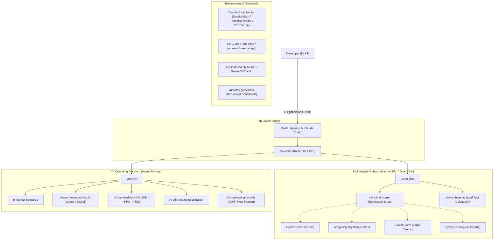

# รายงานการวิเคราะห์สถาปัตยกรรมและแนวคิดของ xeno-skills
*(Architecture Analysis and Technical Breakdown of xeno-skills)*

---

## 1. บทสรุปผู้บริหาร (Executive Summary)

**xeno-skills** เป็นระบบ Agent Skills, Workflow-Enforcement Hooks และมาตรฐานการปฏิบัติงานทางวิศวกรรม (Engineering Operating System) ที่พัฒนาขึ้นโดยทีม **T4 (T4 Labs / Slow-Inc)** เพื่อรองรับการพัฒนาซอฟต์แวร์ในรูปแบบ **Agent-Primary Development** (รูปแบบที่ Coding Agent เช่น Claude Code, Codex, Antigravity/Gemini เป็นผู้ลงมือเขียนโค้ดและพัฒนาหลัก)

โปรเจกต์นี้เริ่มต้นจากการแก้ปัญหาคอขวดของการระดมสมองร่วมกับ AI (Human-in-the-Loop Bottleneck) จนเติบโตเป็นเฟรมเวิร์กควบคุมการทำงานของ AI อย่างเป็นระบบ โดยเน้น **"การบังคับใช้จริง (Enforcement) ไม่ใช่แค่การเขียนคำแนะนำในเอกสาร (Theater/Paperwork)"** ผ่านระบบ Hook, Git Guard, Contract Testing มากกว่า 1,200+ Assertions และมีงานวิจัยเชิงประจักษ์ (Empirical Research) รองรับการตัดสินใจทางสถาปัตยกรรมทุกส่วน

---

## 2. จุดกำเนิดและปรัชญาการออกแบบ (Origin & Core Philosophy)

### 2.1 ปัญหาเดิมของการทำงานกับ AI Coding (Software DX Problems)
1. **Human-AI Communication Bottleneck:** การให้ AI ถาม Developer มนุษย์ทีละข้อในการออกแบบระบบซับซ้อน ทำให้มนุษย์ต้องนั่งเฝ้าจอ พิมพ์ตอบขนาดยาว ซึ่งใช้เวลาและภาระทางสมอง (Cognitive Load) สูงมาก
2. **Model Bias & Single-shot Limitation:** การพึ่งพา LLM โมเดลเดียวมักมีจุดบอดเฉพาะตัว และการสั่งงานแบบส่งไป-รับกลับรอบเดียวมักได้โค้ดที่ไม่รอบคอบ ขาดการตรวจสอบ Edge cases
3. **Context Amnesia & Drift:** Agent มักสูญเสียบริบทเมื่อจบ Session หรือเมื่อเกิด Context Compaction ทำให้งานที่ส่งต่อหลุดกรอบ
4. **Enforcement Theater:** หลายโปรเจกต์เขียนกฎการทำงานไว้มากมายใน Prompt หรือเอกสาร แต่ในทางปฏิบัติ Agent มักแอบข้ามขั้นตอนหรือละเลยกฎเหล่านั้น

### 2.2 ปรัชญาและหลักการออกแบบของ xeno-skills
* **Multi-Turn Negotiation Loop:** Master Agent ทำหน้าที่กระจายโจทย์ให้คณะกรรมการ CLI Agents อิสระหลายค่ายถกเถียงและคัดค้านกันเองจนได้ข้อยุติ แล้วสรุปเฉพาะผลลัพธ์ที่สังเคราะห์แล้วขึ้นมาให้มนุษย์อนุมัติ
* **"Delegate the leaves, own the tree":** Master Agent ควบคุม Architecture ใหญ่และการรวมระบบ (Decomposition & Integration) แล้วมอบหมายเฉพาะงานย่อยระดับปลายกิ่ง (Leaf tasks) ให้ Subagents ทำงานคู่ขนานกัน โดยผลงานทุกชิ้นต้องถูก **Verify เสมอ**
* **Documented ≠ Enforced:** ทุกกฎต้องมี Test หรือ Hook กำกับจริง หากระบุไว้ในเอกสารแต่ไม่มีกลไกตรวจจับ ถือว่าเป็น Defect ของระบบ
* **Index-then-Open (Retrieval-First):** ข้อมูล Context และ Memory ต้องเป็น Index หรือ Pointer ที่เปิดอ่านเฉพาะส่วนที่ต้องใช้ ห้ามยัดเอกสารทั้งก้อนลง Context
* **Surgical & Thin Layer:** เป็นชั้นมาตรฐานเฉพาะทีมที่วางทับและส่งต่องานไปยัง Ecosystem อื่น (เช่น `superpowers`, `mattpocock/skills`, `9arm-skills`) โดยไม่สร้างความซ้ำซ้อน

---

## 3. สถาปัตยกรรมและองค์ประกอบของระบบ (System Architecture)

### 3.1 กลุ่มทักษะการประสานงาน AI หลายตัว (Multi-Agent Orchestration)
* **`clink-brainstorm`:** กระจายโจทย์เพื่อระดมสมองผ่าน **Cognitive Lenses** 4 ด้าน:
  * **Code-centric (Codex):** ตรวจสอบไวยากรณ์และความถูกต้องของโค้ด
  * **System-centric (Antigravity):** วิเคราะห์ความสัมพันธ์ของระบบ โครงสร้างไฟล์ และ Directory
  * **Logic-centric (Claude-9arm):** ตรวจสอบความสมเหตุสมผลเชิงตรรกะและประสิทธิภาพ
  * **Conceptual-centric (Qwen):** เสนอไอเดีย ทฤษฎี และภาพรวมเชิงแนวคิด
* **`clink-subagents`:** มอบหมายงานย่อยที่ Self-contained ให้โมเดลที่เหมาะสมที่สุดตามดัชนีคะแนนจริง (Coding Index vs Agentic Index จาก Artificial Analysis)
* **`using-clink`:** เกตตัดสินใจก่อนเรียก Multi-Agent เพื่อป้องกันการเผา Token โดยไม่จำเป็น

### 3.2 กลุ่มมาตรฐานการทำงานทีม T4 (T4 Operating Standard)
* **`t4-project-bootstrap`:** Setup โครงสร้างเอกสารโปรเจกต์ (`CONTEXT.md`, `PRODUCT.md`, `UBIQUITOUS_LANGUAGE.md`, `DESIGN.md`, Obsidian Vault, CI/CD templates, Git hooks) ให้อยู่ในมาตรฐานเดียวกัน
* **`t4-agent-memory`:** ระบบ Long-term Working Memory (Obsidian Vault `Home.md` Map-of-Content, `OPEN-WORK-LEDGER.md`, `DONE.md`) ช่วยให้ Agent ตัวใหม่กู้คืน State และทำงานต่อได้ทันที
* **`t4-dev-workflow`:** Feature Pipeline ครบวงจร (CRISPE Intake $\rightarrow$ Grill $\rightarrow$ Survey $\rightarrow$ PRD $\rightarrow$ Native Sub-issues $\rightarrow$ TDD)
* **`t4-afk`:** วินัยการรันงานอัตโนมัติแบบมนุษย์ไม่อยู่หน้าจอ (Preflight Scope-lock, Stop-and-park rules, Revert-to-green, Landing digest)
* **`t4-bro`:** มาตรฐานภาษาไทยระดับ Developer เข้าใจง่าย ตรงประเด็น ไม่แปลศัพท์เทคนิคจนเพี้ยน

### 3.3 การควบคุมและป้องกันข้อผิดพลาด (Behavioral & Quality Guardrails)
* **`karpathy-guidelines`:** กฎพฤติกรรมลดความผิดพลาดของ LLM (คิดก่อนเขียน, แก้ไขแบบ Surgical minimal diff, มีเกณฑ์ความสำเร็จที่พิสูจน์ได้)
* **`design/*`:** ตระกูลออกแบบ Web/UI (กฎ Micro-UI 60-30-10, 8pt Spacing, Typography Scale, LIFT Model, 3-Brain Persona)
* **`ask-xeno`:** Router ชั้นบนสุดที่มีการจำกัดขนาดไฟล์ไม่เกิน 1.8 KB และมี Contract Test บังคับให้เข้าถึงทุก Skill ได้ภายใน 2 ทอด (2-Hop Navigation)

### 3.4 ชั้นการบังคับใช้กฎ (Workflow-Enforcement Layer)
1. **Claude Code Hooks:**
   * `SessionStart`: ฉีดเนื้อหา `using-t4` อัตโนมัติในตอนเริ่ม Session
   * `UserPromptSubmit`: เตือน Rails สั้นๆ ทุก Turn เพื่อกันไม่ให้ Agent Drift ออกนอกลู่นอกทาง
   * `PreToolUse`: ดักจับคำสั่ง Git อันตราย (`reset --hard`, force-push), ตรวจจับว่า PR มี Issue อ้างอิงหรือไม่ และรัน **Ship Gate** (คำสั่ง Verify ของโปรเจกต์) จริงก่อนอนุญาตให้สั่ง `gh pr merge`
2. **Git Pre-Push Guards:** ตรวจสอบความถูกต้องของ Git Tree, ป้องกันการ Push โค้ดที่ไม่มี Issue Ref และบล็อกไฟล์ขยะ/Build Artifacts

---

## 4. งานวิจัยเชิงประจักษ์และการทดสอบระบบ (Empirical Research & Testing)

ความโดดเด่นสำคัญของ `xeno-skills` คือการใช้ข้อมูลจากการทดลองจริง (Empirical Data) มาออกแบบระบบ:

1. **การวิจัยผลลัพธ์การบีบอัดบริบท (Context Compaction Yield Research):**
   * วิเคราะห์ข้อมูลจากการรัน `/compact` จริง 113 ครั้ง ครอบคลุม 10 โปรเจกต์
   * **ผลลัพธ์:** ได้ค่ามัธยฐานการลด Context อยู่ที่ **85%** (เมื่อ Compact ที่ Context เฉลี่ย 719K)
   * **การค้นพบสำคัญ:** พบ **Dead Zone** ที่ Context ต่ำกว่า 150K ซึ่งการ Compact แทบไม่ได้ผล (Return 0% หรือกลับมีขนาดใหญ่ขึ้น) นำไปสู่การออกแบบตัวกระตุ้นการ Compact ที่แม่นยำ
2. **ความคุ้มค่าทางเศรษฐศาสตร์ของ Subagent (Token Economics):**
   * คำนวณจุดคุ้มทุนของการเปิด Subagent แยก Task เทียบกับการทำงานใน Context หลัก เพื่อหาความสมดุลระหว่างค่าใช้จ่ายและประสิทธิภาพ
3. **ระบบ Contract Testing มากกว่า 1,200+ Assertions:**
   * มีชุดเทสต์ตรวจ Byte Budget ของไฟล์ Markdown, ตรวจความถูกต้องของ Routing Table, ตรวจสอบพฤติกรรมของ Hooks และ Regex Parsers ทั้งหมดใน `tests/`

---

## 5. สถานะปัจจุบันและพัฒนาการล่าสุด (Current Progress & Milestones)

| วันที่ / หมุดหมาย | ความคืบหน้าสำคัญ (Key Achievements) |
|---|---|
| **ส.ค. 2026 (#304, #306)** | **T4-Compact & Session Handoff Validity:** สร้างตัวตรวจสอบความถูกต้องของ Handoff ข้าม Session ดักจับไฟล์ค้าง/ไม่สมบูรณ์ และควบคุมผ่าน Stream Transport |
| **ส.ค. 2026 (#301)** | **CRISPE Intake Guard:** กำหนดกรอบการถามข้อมูลที่ขาดตอนเริ่มงาน เพื่อป้องกันไม่ให้ Agent ถามมนุษย์พร่ำเพรื่อ หรือเริ่มงานโดยที่โจทย์ยังไม่ชัดเจน |
| **ส.ค. 2026 (#176, #235)** | **Compliance Reviewer & Gate Hardening:** เพิ่ม 19 Enforcement Hooks, ปรับปรุงโครงสร้าง Issue Hierarchy (`Plan -> PRD -> Sub-issue`) และอุดช่องโหว่การจำลองผลเทสต์ปลอม |
| **ส.ค. 2026 (#93)** | **Self-Bootstrapped Operating Layer:** ประยุกต์ใช้มาตรฐาน T4 เข้ากับตัว Repo `xeno-skills` เองอย่างสมบูรณ์ |
| **Production Adoption** | ใช้งานเป็นมาตรฐานหลักในโปรเจกต์จริง เช่น `MangaDock`, `T4-Fastwork` และ `xeno-skills` |

---

## 6. บทเรียนและข้อคิดสำหรับการออกแบบ Agentic Framework (Key Takeaways)

1. **อย่าเชื่อใจ Prompt เพียงอย่างเดียว (Prompts Guide, Hooks Enforce):**
   * Prompt และ System Prompt ทำหน้าที่เพียง "แนะนำ" แต่หากไม่มี Hook และ Guardrails ในระดับ Tool Execution หรือ Git Level คอยดักจับ Agent จะมีโอกาสหลุดระเบียบวินัยเสมอ
2. **โครงสร้างหน่วยความจำต้อง Retrieval-First:**
   * การส่ง Memory ทั้งก้อนลง Context ทำให้สิ้นเปลือง Token และบั่นทอนความสามารถในการคิดวิเคราะห์ของโมเดล การทำ Map-of-Content (ดัชนีชี้ตำแหน่ง) แล้วให้ Agent ดึงเฉพาะไฟล์ที่เกี่ยวข้องเป็นวิธีที่ยั่งยืนที่สุด
3. **การออกแบบ Multi-Agent ต้องแบ่งตามความสามารถจริง (Benchmark-Driven):**
   * ควรแบ่งงานตามจุดแข็งของโมเดลแต่ละตัว (เช่น งานโค้ดยากที่ตรวจง่ายส่งให้ Codex, งานสำรวจระบบส่งให้ Antigravity, งานควบคุมกระบวนการส่งให้ Claude) และต้องไม่ละเลยการ Verify ผลงานก่อนผสานรวม
4. **วัดผลด้วยตัวเลขจริง ไม่ใช่ความรู้สึก (Data-Driven Refactoring):**
   * ประสิทธิภาพของ Context, Token, และการ Compact ต้องถูก Probe และวัดผลจาก Log การใช้งานจริงเสมอ
